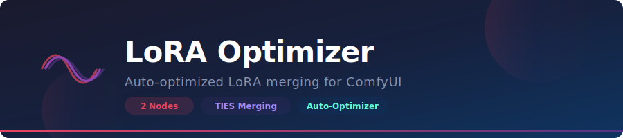
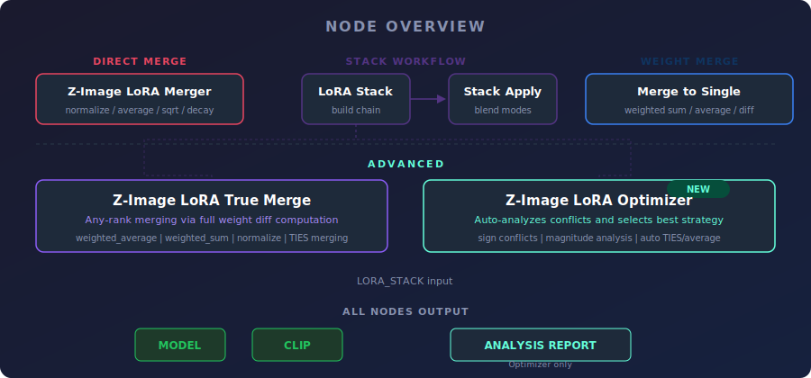
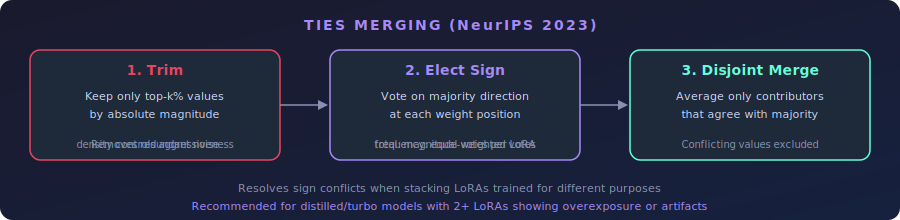
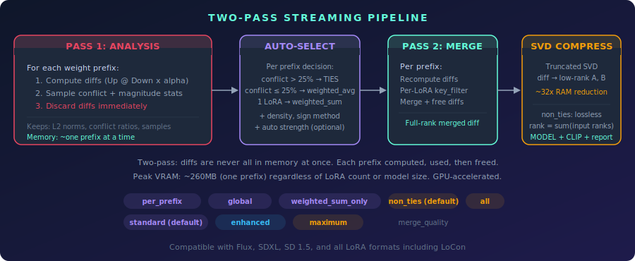

<p align="center">
  
</p>

<p align="center">
  
  
  
  
  
</p>

---

A ComfyUI node pack for combining multiple LoRAs **without overexposure or artifacts** on distilled models. Provides 6 nodes ranging from simple blend-mode application to an auto-optimizer that analyzes your LoRA stack and selects the best merge strategy.

## The Problem

Stacking LoRAs in ComfyUI adds their effects together. On distilled/turbo models (Z-Image Turbo, SDXL-Turbo, LCM, Lightning), the accumulated effect exceeds what the model can handle, causing **overexposure, color blowout, and artifacts**.

```
model += lora1_effect x strength1
model += lora2_effect x strength2
total effect = strength1 + strength2  -->  easily exceeds 1.0
```

This pack solves it with normalization strategies, true weight-diff merging, TIES conflict resolution, and automatic analysis.

## Node Overview

<p align="center">
  
</p>

## Nodes

### Z-Image LoRA Merger

The main node. Applies up to 5 LoRAs with automatic strength normalization.

| Mode | Description | Best for |
|------|-------------|----------|
| `normalize` | Keeps total energy (sum of squares) at target | **Recommended default** |
| `average` | Divides each strength by LoRA count | Equal contribution |
| `sqrt_scale` | Scales by 1/sqrt(n) | Independent effects |
| `linear_decay` | 1, 1/2, 1/3, 1/4... | One dominant + supporting |
| `geometric_decay` | 1, 0.5, 0.25, 0.125... | Strongly weighted priority |
| `additive` | No normalization | Standard ComfyUI behavior |

**Inputs:** `MODEL`, `CLIP`, blend mode, target strength, up to 5 LoRA selectors with individual strengths.

**Outputs:** `MODEL`, `CLIP`

---

### Z-Image LoRA Stack + Stack Apply

A two-node workflow for flexible LoRA chaining. **Stack** nodes can be chained to build a list of any length, then **Stack Apply** merges them with the same blend modes as the main merger.

**Stack inputs:** LoRA selector, strength, optional previous `LORA_STACK`

**Stack Apply inputs:** `MODEL`, `CLIP`, `LORA_STACK`, blend mode, target strength

The stack is also the input format for True Merge and the Optimizer.

---

### Z-Image LoRA Merge to Single

Pre-merges LoRA weight tensors into a single virtual LoRA before applying to the model. Works best when LoRAs share the same rank.

| Method | Description |
|--------|-------------|
| `weighted_sum` | Weighted sum of all LoRA tensors |
| `weighted_average` | Normalized weighted average |
| `add_difference` | First LoRA + weighted diff from others |

**Inputs:** `MODEL`, `CLIP`, merge method, output strength, up to 3 LoRA selectors with weights.

**Outputs:** `MODEL`, `CLIP`

---

### Z-Image LoRA True Merge

Properly merges LoRAs of **any rank combination**. Instead of operating on raw A/B matrices (which must be the same shape), it expands each LoRA into its full weight diff first, then merges the diffs.

```
Standard merge: A1[rank 32] + A2[rank 256] = shape mismatch

True Merge:
  diff1 = Up1 @ Down1 x alpha  -->  [4096 x 4096]
  diff2 = Up2 @ Down2 x alpha  -->  [4096 x 4096]
  merged = merge(diff1, diff2)  -->  works for any rank
```

Supports **TIES-Merging** (Trim, Elect Sign, Disjoint Merge) from NeurIPS 2023 for resolving sign conflicts between LoRAs.

<p align="center">
  
</p>

| Mode | Description |
|------|-------------|
| `weighted_average` | Normalized weighted average of diffs |
| `weighted_sum` | Direct weighted sum |
| `normalize` | Energy-normalized merge |
| `ties` | TIES: trim noise, resolve sign conflicts, merge agreeing values |

**TIES parameters:**
- **density** (0.01-1.0): Fraction of weights to keep. Lower = more aggressive noise removal. Default 0.5.
- **majority_sign_method**: `frequency` (one vote per LoRA) or `total` (magnitude-weighted votes).

**Inputs:** `MODEL`, `CLIP`, merge mode, output strength, up to 4 LoRA selectors with strengths, TIES parameters.

**Outputs:** `MODEL`, `CLIP`

> Uses more memory than standard application because it expands LoRAs into full-rank tensors.

---

### Z-Image LoRA Optimizer

The auto-optimizer. Takes a `LORA_STACK`, analyzes the LoRAs, and automatically selects the best merge mode and parameters. Outputs the merged result plus a detailed analysis report explaining what it chose and why.

<p align="center">
  
</p>

**What it analyzes:**
- Per-LoRA metrics (rank, key count, effective L2 norms)
- Pairwise sign conflict ratios (sampled for efficiency)
- Magnitude distribution across all weight diffs
- Key overlap between LoRAs

**How it decides:**

| Condition | Decision |
|-----------|----------|
| Sign conflict > 25% | TIES mode (resolves conflicts) |
| Sign conflict <= 25% | weighted_average (simple, effective) |
| Magnitude ratio > 2x between LoRAs | `total` sign method (stronger LoRA gets more influence) |
| Magnitude ratio <= 2x | `frequency` sign method (equal votes) |
| TIES mode selected | Auto-density estimated from magnitude distribution |

**Inputs:** `MODEL`, `CLIP`, `LORA_STACK`, output strength, clip strength multiplier.

**Outputs:** `MODEL`, `CLIP`, `STRING` (analysis report)

**Example report output:**
```
==================================================
Z-IMAGE LORA OPTIMIZER - ANALYSIS REPORT
==================================================

--- Per-LoRA Analysis ---
  style_lora.safetensors:
    Strength: 1.0
    Keys: 192
    Avg rank: 64
    L2 norm (mean): 0.0847
  detail_lora.safetensors:
    Strength: 0.8
    Keys: 192
    Avg rank: 32
    L2 norm (mean): 0.0423

--- Pairwise Analysis ---
  style_lora.safetensors vs detail_lora.safetensors:
    Overlapping positions: 89420
    Sign conflicts: 31297 (35.0%)

--- Collection Statistics ---
  Total LoRAs: 2
  Total unique keys: 196
  Avg sign conflict ratio: 35.0%
  Magnitude ratio (max/min L2): 2.00x

--- Auto-Selected Parameters ---
  Merge mode: ties
  Density: 0.42
  Sign method: frequency

--- Reasoning ---
  Sign conflict ratio 35.0% > 25% threshold -> TIES mode selected
    TIES resolves sign conflicts via trim + elect sign + disjoint merge
  Auto-density estimated at 0.42 from magnitude distribution
  Magnitude ratio 2.00x <= 2x -> 'frequency' sign method (equal voting)
    Similar-strength LoRAs get equal votes

--- Merge Summary ---
  Keys processed: 196
  Model patches: 168
  CLIP patches: 28
  Output strength: 1.0
  CLIP strength: 1.0

==================================================
```

Connect the `STRING` output to a **Show Text** node to see the report in ComfyUI.

> **Memory note:** The optimizer expands all LoRA diffs into full-rank tensors for analysis. For SDXL with 4 LoRAs this can exceed 10GB. For large stacks or SDXL models, consider using True Merge with manually chosen parameters.

## Comparison

| Node | Any rank | Handles conflicts | Auto-params | Memory | Speed |
|------|----------|-------------------|-------------|--------|-------|
| **LoRA Merger** | N/A (sequential apply) | No | No | Low | Fast |
| **Stack Apply** | N/A (sequential apply) | No | No | Low | Fast |
| **Merge to Single** | Same rank only | No | No | Medium | Medium |
| **True Merge** | Yes | Yes (TIES) | No | High | Slow |
| **Optimizer** | Yes | Yes (auto) | Yes | High | Slow |

## Quick Start

**For most users:** Use **Z-Image LoRA Merger** with `normalize` mode and `target_strength` 0.7-0.9.

**For mixed-rank LoRAs:** Use **Z-Image LoRA True Merge** with `weighted_average`.

**For maximum quality (hands-off):** Build a stack with **Z-Image LoRA Stack** nodes, connect to **Z-Image LoRA Optimizer**, and let it figure out the best settings.

**For TIES merging with manual control:** Use **Z-Image LoRA True Merge** with `ties` mode. Start with density 0.5 and `frequency` sign method.

## Installation

### ComfyUI Manager
Search for "Z-Image LoRA Merger" in ComfyUI Manager and install.

### Manual
```bash
cd ComfyUI/custom_nodes/
git clone https://github.com/ethanfel/ComfyUI-ZImage-LoRA-Merger.git
```
Restart ComfyUI. All 6 nodes appear under the `loaders/lora` category.

## Compatibility

- **Models:** SD 1.5, SDXL, Flux, and other architectures supported by ComfyUI
- **LoRA formats:** Standard LoRA, LoCon, diffusers formats
- **Flux sliced weights:** Handled correctly (linear1_qkv offsets)

## Credits

- Original node pack by [DanrisiUA](https://github.com/DanrisiUA)
- Fork maintained by [ethanfel](https://github.com/ethanfel)
- TIES-Merging: [Yadav et al., NeurIPS 2023](https://arxiv.org/abs/2306.01708)

## License

MIT License - see [LICENSE](LICENSE).
